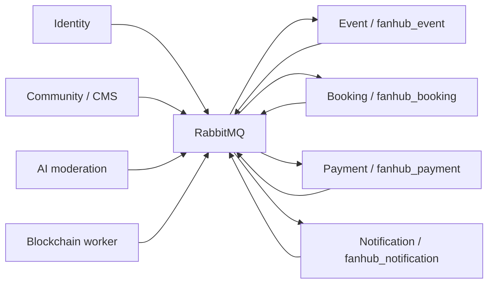

# Quy tắc dữ liệu và tích hợp cho task 21–54

Đây là quyết định thiết kế bổ sung để chuyển tài liệu phân công thành schema có thể triển khai. Các trạng thái, idempotency key và trường kỹ thuật dưới đây không phải hợp đồng API hoàn chỉnh đã được tài liệu nguồn quy định. Cần dùng chúng khi triển khai API và thống nhất event contract với đồng đội.

Cập nhật triển khai: EventService đã có API 21–32, custom inbox/outbox worker, consumers và các record tích hợp C#. [README EventService](../services/dotnet/FanHub.EventService/README.md) mô tả chính xác trạng thái/HTTP contract đang chạy. Các đoạn mô tả Booking, Payment, Notification dưới đây vẫn là thiết kế cho giai đoạn tiếp theo.

## Ranh giới service



Không đọc bảng của service khác, không liên kết DbContext chéo service, không gọi API đồng bộ để lấy dữ liệu nghiệp vụ. API đọc bản sao local. Bản sao chưa có hoặc đã lỗi thời cần chờ đồng bộ/retry có giới hạn; không trả kết quả thành công giả. Có eventual consistency giữa database.

`CATEGORY` gốc thuộc Community/CMS theo phần phân bổ của báo cáo. Task 29–30 dùng `CATEGORY_PROJECTION`; tác vụ quản trị 79–81 do Văn Giỏi thực hiện và phải phát event thay đổi danh mục. Chưa có các publisher này trong repo.

## Bản sao và sự kiện cần thống nhất

| Bên phát | Sự kiện dự kiến | Bên nhận / dữ liệu tối thiểu |
|---|---|---|
| Identity | `UserCreatedEvent`, `UserUpdatedEvent`, `UserBannedEvent` đã có record C# | Cả 4 service: user ID, tên/avatar, trạng thái, thời điểm nguồn |
| Community | `CategoryChanged`, `CategoryDeleted` | Event: category ID, parent ID, name, deleted, version |
| Event | `EventChanged`, `EventCancelled` | Booking: event ID, organizer, dates, capacity, status, version; GPS nhận location |
| Event | `EventStaffChanged` | Booking: event ID, user ID, role, active, version |
| Event | `EventSubmittedForReview` | AI/Admin: nội dung để duyệt; kết quả đưa về Event sở hữu trạng thái |
| Booking | `BookingCreated`, `BookingChanged` | Payment: booking ID, purchaser ID, amount, currency, expiry, status; Event: attendee và owner hiện tại |
| Booking | `UpgradeRequested` | Payment: upgrade ID, booking ID, user ID, price difference, currency, expiry |
| Payment | `PaymentSucceeded`, `PaymentFailed`, `RefundSucceeded`, `RefundFailed` | Booking: transaction/booking/upgrade ID, số tiền, currency, version |
| Booking | `TicketMintRequested`, `TicketTransferRequested` | Blockchain: ticket ID, user/wallet đích, correlation ID |
| Blockchain | `TicketMinted`, `TicketTransferred`, các kết quả thất bại | Booking: ticket ID, NFT token, tx hash, operation ID |
| Các service | Thông báo nghiệp vụ được chọn | Notification: source message ID, recipient ID, loại, payload tối thiểu |

EventService hiện dùng các record có hậu tố `Event` trong Shared.Contracts và đã có consumer/binding tương ứng. Các sự kiện của Booking/Payment/Blockchain vẫn là đề xuất. Báo cáo nói `BookingCreated` dùng cho thanh toán; workbook task 71 dùng `order.paid` để mint NFT. Khi code cần map nhất quán: chỉ mint sau khi xác nhận trả tiền, không mint ngay khi giữ chỗ. Metadata QR/chữ ký thuộc service Blockchain; không lưu private key tại Booking.

Mỗi message mới cần `message_id`, `event_type`, `schema_version`, `aggregate_id`, `aggregate_version`, `occurred_at`, `correlation_id`, `payload`. `aggregate_version` là số tăng theo bản ghi nguồn; có thể chuyển rowversion của nguồn sang số thứ tự trước khi phát, nhưng không so rowversion giữa hai database. Các record Identity hiện tại chỉ có CreatedAt/UpdatedAt/BannedAt; consumer dùng `source_updated_at`, giữ trạng thái ban khi nhận event cũ, và cần thống nhất version nếu timestamp trùng. Không tự ý thay contract của đồng đội ở giai đoạn này.

Ghi thay đổi nghiệp vụ và `OUTBOX_MESSAGE` trong cùng local transaction. Worker claim outbox có lease (`lock_id`, `locked_until`), publisher confirm rồi đánh dấu `published_at`; message có thể được phát lại nếu crash giữa confirm và cập nhật DB. Consumer ghi `INBOX_MESSAGE` và thay đổi nghiệp vụ trong cùng transaction, ack sau commit. PK `(consumer,message_id)` chặn xử lý trùng. Đừng ghi inbox trước rồi commit riêng. Retry transient failure, DLQ cho poison message, có backoff và giới hạn; chưa triển khai worker ở giai đoạn database.

Các bảng inbox/outbox là schema tự quản lý; chúng **không tự tương thích** với EF Outbox của MassTransit. Khi code chọn worker tùy chỉnh hoặc migration chuyển sang schema MassTransit, không chỉ bật middleware rồi cho rằng các bảng đã hoạt động.

## Quy tắc khi code API

### Event và phân quyền

User ID lấy từ JWT đã xác thực. `EventOwner` hoặc `Admin` mới tạo/quản trị sự kiện, các thao tác quản trị phải kiểm tra `organizer_id`; staff chỉ thao tác đúng sự kiện được phân công. Mọi request tới danh sách cá nhân/vé/ví/thông báo đều lọc theo JWT subject. DB login tách service không thay thế phân quyền user trong API.

Luồng EventService đang triển khai: `Draft → PendingReview → Published` khi nhận quyết định Approved, hoặc `PendingReview → Rejected`; `Published → Cancelled`. Giá trị Approved/Completed vẫn được schema hỗ trợ nhưng chưa có job tự chuyển Completed. Task 26 là gửi duyệt, không cho người tổ chức tự xuất bản ngay. Consumer kiểm tra `review_request_id` và ghi `EVENT_REVIEW` khi nhận quyết định AI/Admin. DELETE task 27 là hủy nghiệp vụ, giữ lịch sử vé/giao dịch.

### Booking và tồn vé

Một `BOOKING_REQUEST` có quantity; mỗi `TICKET_BOOKING` đại diện **một vé**. `purchaser_id` giữ người mua ban đầu, `user_id` là chủ vé hiện tại. Task 36 `{id}` sử dụng `booking_id` của vé; task 34 sử dụng `request_id` của yêu cầu bất đồng bộ. Thanh toán giai đoạn đầu theo từng vé; nếu cần checkout nhiều vé một lần, phải bổ sung payment order/items, không dùng request ID thay booking ID.

Reservation: lưu request + outbox trong transaction; unique `(user_id,idempotency_key)` và `request_hash` giúp phân biệt retry hợp lệ với key tái sử dụng cho body khác. BookingService hiện khóa transaction theo event bằng `sp_getapplock`, kiểm tra tồn/sức chứa rồi cập nhật EF với rowversion và tạo đủ vé. UPDATE có điều kiện dưới đây là phương án tương đương cho thao tác tồn đơn lẻ:

```sql
UPDATE dbo.TICKET_TYPE
SET reserved_quantity = reserved_quantity + @quantity
WHERE ticket_type_id = @type
  AND is_active = 1
  AND sale_start <= SYSUTCDATETIME() AND sale_end > SYSUTCDATETIME()
  AND total_quantity - reserved_quantity - sold_quantity >= @quantity;
-- @@ROWCOUNT phải bằng 1; nếu không, từ chối và không tạo vé.
```

Code đồng thời kiểm tra trạng thái Event projection. Khi tạo/sửa hạng vé, khóa event projection để bảo đảm tổng `total_quantity` của các hạng không vượt `capacity`; CHECK từng hàng không kiểm tra được tổng nhiều hạng. Tác vụ cấu hình hạng vé không nằm trong 21–54, cần thống nhất luồng organizer/admin trước khi bán; hiện không seed tự động hạng vé.

Thanh toán thành công: trong transaction khóa vé, chỉ chuyển từ trạng thái hợp lệ, giảm reserved/tăng sold đúng một lần, phát event mint. Hết hạn: worker chuyển trạng thái và nhả reserved đúng một lần. Nếu webhook tới sau khi nhả tồn, chạy quy trình bù/hoàn tiền, không kích hoạt vé vượt tồn. Free ticket có giá 0 đi qua luồng xác nhận miễn phí tại Booking, không tạo transaction thanh toán amount 0.

Chuyển vé: khóa vé và kiểm tra owner/status, không chuyển khi đang check-in/upgrade/cancel. Tạo `TICKET_TRANSFER` Pending, chỉ đổi owner sau kết quả blockchain thành công. Nâng hạng: chỉ cùng event, tier cao hơn, giữ tồn hạng đích, phát quote chênh lệch, khi trả tiền thành công đổi hạng và nhả hạng cũ trong transaction; thất bại/hết hạn trả lại tồn giữ. Chặn transfer và upgrade đồng thời bằng khóa/trạng thái vé, không chỉ dựa vào hai unique index riêng.

QR check-in: xác minh chữ ký/TTL và dữ liệu sở hữu theo hợp đồng Blockchain, kiểm tra staff projection và trạng thái vé, INSERT `TICKET_CHECK_IN` + đổi trạng thái trong một transaction. PK booking ID chỉ chặn check-in trùng, không tự xác minh QR.

### Payment và ví

Amount/currency/user/expiry lấy từ `BOOKING_PROJECTION` hoặc `UPGRADE_PROJECTION`, không lấy trực tiếp giá do client gửi. Xác thực chữ ký, merchant, amount, currency và transaction reference của webhook trước khi đánh dấu paid. Không dùng trường `status` của request mẫu làm bằng chứng thanh toán. Webhook hợp lệ xử lý idempotent; `provider_event_key` phải là khóa chuẩn hóa ổn định của provider, không phải random GUID mỗi lần nhận.

Khóa payment row khi chuyển trạng thái. Unique index chặn hai payment Succeeded cho cùng booking/upgrade nhưng không ngăn nhà cung cấp thực tế thu tiền hai lần; cần một intent đang hoạt động cho mỗi mục tiêu ở tầng nghiệp vụ và xử lý hoàn tiền khi provider báo kết quả muộn.

Ví: khóa wallet bằng `UPDLOCK` hoặc UPDATE có điều kiện/rowversion; cập nhật balance và ghi ledger, payment, outbox trong một transaction. Deposit chỉ tăng balance sau webhook thành công. Kiểm tra wallet/user/currency/purpose khớp transaction trước khi ghi ledger. Ledger ghi số tiền dương; `entry_type=Payment` là trừ, `Deposit/Refund` là cộng. Balance là snapshot, phải đối chiếu ledger khi vận hành. Không ghi số thẻ/CVV, private key hoặc secret thanh toán vào webhook payload.

Refund: khóa payment gốc, chỉ hoàn transaction Succeeded, currency theo transaction gốc; tổng refund Pending/Processing/Succeeded không vượt số tiền đã thu. Điều kiện tổng này cần transaction, không được database CHECK một hàng bảo đảm. Kiểm tra quyền người yêu cầu và quy tắc hủy vé trước khi tạo refund. Với ví, refund ghi entry bù; không UPDATE/DELETE ledger cũ. Chỉ phát RefundSucceeded khi provider/ví xác nhận thực sự.

### Notification

`read_at IS NULL` tương đương chưa đọc; task 52–53 cập nhật theo cả notification ID và JWT user ID, không nhận user ID tùy ý từ body. Unique `(user_id,source_message_id,type)` chống cùng message tạo lặp thông báo. Không lưu `is_read` độc lập để tránh hai trạng thái lệch nhau.

Token đăng ký một lần theo provider/device và provider/hash. Khi người dùng đăng nhập lại trên cùng máy, chuyển token sang user hiện tại trong transaction. Worker kiểm tra lại token vẫn thuộc recipient trước khi gửi delivery cũ; nếu đổi owner thì đánh dấu Skipped. Không ghi token nguyên văn vào log, vô hiệu hóa token khi provider báo invalid. Database chỉ lưu trạng thái delivery; chưa có FCM/APNs worker hoặc real-time Redis/WebSocket.
